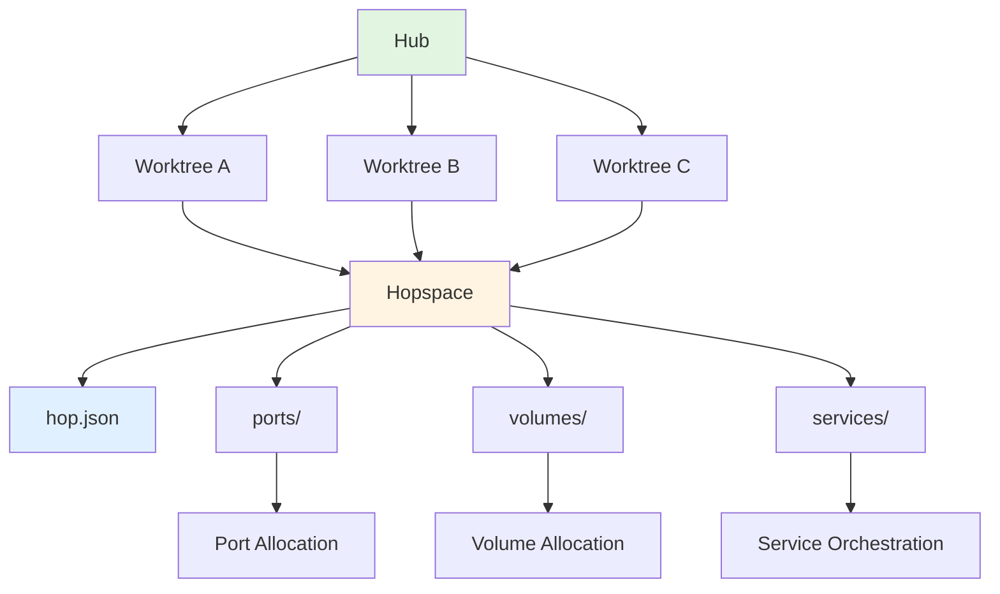
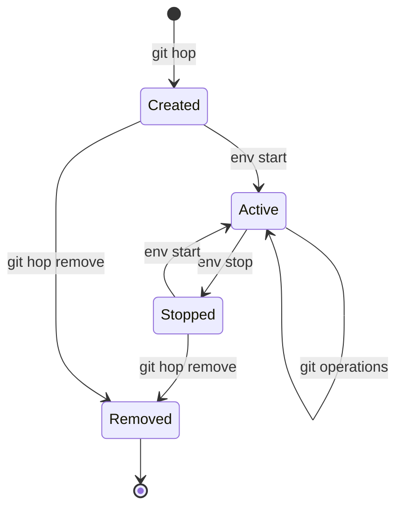
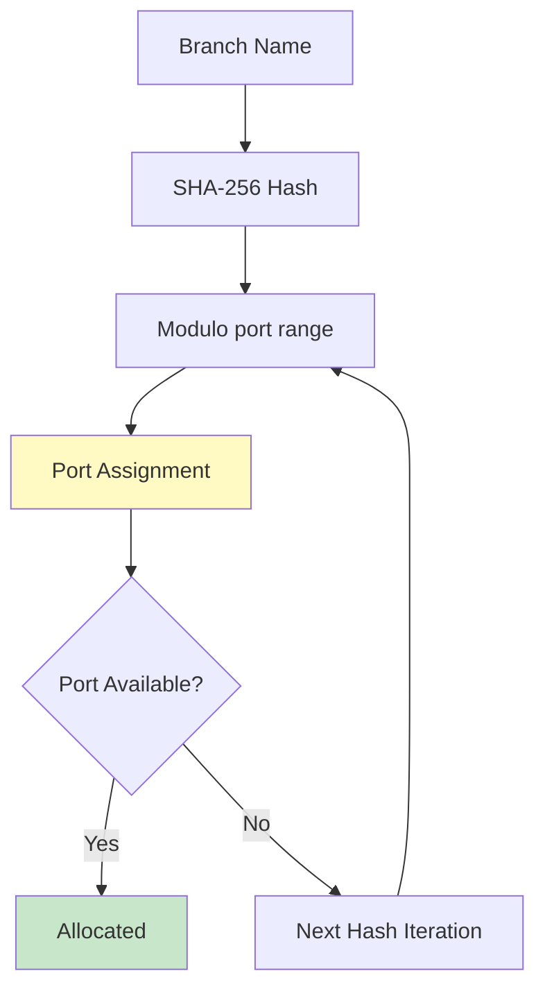

# Core Concepts

git-hop builds on Git worktrees with a few key abstractions. Understanding these will help you use git-hop effectively.

## Architecture Overview



## Hubs

A *hub* is a directory that acts as the workspace for a single repository. It contains symlinks to all your worktrees, making it easy to switch between branches.

### When to Create a Hub

Create a hub when you:
- Want to work with a new repository
- Need to manage multiple branches simultaneously
- Want a clean, organized workspace

### Hub Structure

```
my-project/
  main -> ~/.local/share/git-hop/github.com/org/my-project/main
  feature-x -> ~/.local/share/git-hop/github.com/org/my-project/feature-x
  feature-y -> ~/.local/share/git-hop/github.com/org/my-project/feature-y
  hop.json
```

### Hub Configuration

Each hub has a `hop.json` file for configuration:

```json
{
  "auto_env_start": "detect",
  "port_base": 10000,
  "port_limit": 5000
}
```

## Hopspaces

A *hopspace* is the canonical storage location for all worktrees of a single repository. It contains the actual git objects, configuration, and service data.

### Location

Hopspaces are stored at:

```
$GIT_HOP_DATA_HOME/<server>/<org>/<repo>/
```

Default `$GIT_HOP_DATA_HOME` by OS:
- **Linux/Unix**: `~/.local/share/git-hop`
- **macOS**: `~/Library/Application Support/git-hop`
- **Windows**: `%LOCALAPPDATA%\git-hop`

### Hopspace Structure

```
~/.local/share/git-hop/github.com/org/my-project/
  hop.json
  ports/
    main.json
    feature-x.json
  volumes/
    main/
    feature-x/
  services/
    docker-compose.main.yml
    docker-compose.feature-x.yml
  main/
  feature-x/
```

## Worktrees

A *worktree* is a Git worktree created and managed by git-hop. Each worktree is linked to a branch and has its own isolated environment.

### Worktree Isolation

Each worktree has:
- **Unique ports**: Deterministic allocation prevents conflicts
- **Isolated volumes**: Separate data per branch
- **Independent services**: Run different service versions per branch
- **Symlinked access**: Accessible via hub for convenience

### Worktree Lifecycle



## Deterministic Allocation

git-hop uses stable hashing to allocate resources:

- **Same branch** = **same ports** (reproducible anywhere)
- **Different branches** = **different ports** (no conflicts)
- **Predictable allocation** = **no manual config**

### Port Allocation Algorithm



### Example

| Branch | Ports |
|--------|-------|
| main | 10100-10102 |
| feature-x | 11500-11502 |
| pr-123 | 12300-12302 |

The same branch always gets the same ports, even across different machines.

## Services

git-hop automatically detects and orchestrates Docker services when service definitions exist.

### Service Detection

git-hop looks for:
- `docker-compose.yml`
- `docker-compose.yaml`
- `docker-compose.<branch>.yml`
- `.git-hop/services.yml`

### Service Lifecycle

```bash
# Auto-start when creating worktree
git hop feature-x

# Manual start
git hop env start

# Stop services
git hop env stop

# Restart
git hop env restart
```

### Service Isolation

Each branch gets:
- **Unique container names**: `my-project-feature-x-db-1`
- **Isolated networks**: No cross-branch communication
- **Separate volumes**: Data doesn't leak between branches
- **Independent lifecycles**: Stop one without affecting others

## Dependency Sharing

git-hop automatically shares dependencies across worktrees to save disk space and installation time. When you have multiple branches with the same lockfile, dependencies are installed once and symlinked to each worktree.

### How It Works

1. **Lockfile Hashing**: git-hop hashes your lockfile (package-lock.json, go.sum, etc.) using SHA256
2. **Centralized Storage**: Dependencies are installed to `$GIT_HOP_DATA_HOME/org/repo/deps/{depsdir}.{hash}/`
3. **Symlink Creation**: Each worktree gets a symlink pointing to the shared storage
4. **Usage Tracking**: A registry tracks which branches use which dependencies

### Supported Package Managers

git-hop supports these package managers out of the box:

| Package Manager | Detect File | Lockfile | Deps Directory |
|----------------|-------------|----------|----------------|
| npm | package.json | package-lock.json | node_modules |
| pnpm | pnpm-lock.yaml | pnpm-lock.yaml | node_modules |
| yarn | yarn.lock | yarn.lock | node_modules |
| Go | go.mod | go.sum | vendor |
| pip | requirements.txt | requirements.txt | venv |
| cargo | Cargo.toml | Cargo.lock | target |
| composer | composer.json | composer.lock | vendor |
| bundler | Gemfile | Gemfile.lock | vendor/bundle |

### Custom Package Managers

You can define custom package managers in `$XDG_CONFIG_HOME/git-hop/global.json`:

```json
{
  "packageManagers": [
    {
      "name": "bun",
      "detectFiles": ["bun.lockb"],
      "lockFiles": ["bun.lockb"],
      "depsDir": "node_modules",
      "installCmd": ["bun", "install", "--frozen-lockfile"]
    }
  ]
}
```

Custom package managers can override built-in ones by using the same `name`.

### Benefits

- **Space Savings**: Install once per lockfile instead of per branch
- **Time Savings**: No reinstall when switching to a branch with the same lockfile
- **Multi-PM Support**: Handles repos with npm + Go + pip simultaneously
- **Safe Cleanup**: Manual garbage collection prevents accidental deletion

### Maintenance

#### Check Dependency Health

```bash
git hop doctor
```

This checks for:
- Broken symlinks (pointing to missing deps)
- Stale symlinks (lockfile changed but symlink outdated)
- Local folders (user ran `rm -rf node_modules && npm install`)
- Orphaned dependencies (no branches using them)

#### Auto-fix Issues

```bash
git hop doctor --fix
```

Automatically repairs:
- Recreates missing dependencies
- Updates stale symlinks
- Replaces local folders with shared symlinks

#### Clean Up Orphaned Dependencies

```bash
git hop env gc
```

Removes dependencies that are no longer used by any branch.

## What's Next?

- [Commands](./04-commands) - Learn how to use git-hop commands
- [Configuration](./05a-basics) - Customize behavior
- [Workflows](./06-workflows) - See git-hop in action
