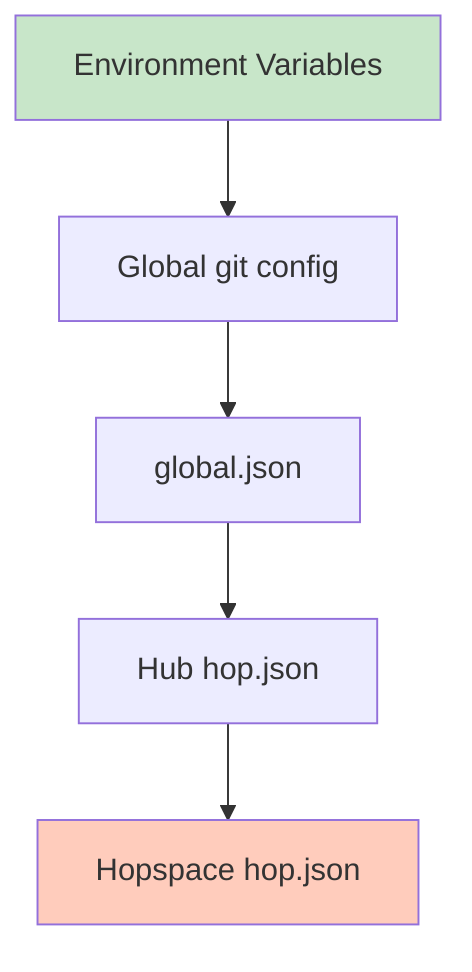

# Configuration Basics

git-hop is configured through a hierarchical system of configuration files and environment variables.

## Configuration Hierarchy

Configuration is loaded from multiple sources, with higher-priority sources overriding lower-priority ones:



Priority (highest to lowest):

1. **Environment variables**
2. **Global git config**
3. `$GIT_HOP_CONFIG_HOME/global.json`
4. Hub-level `hop.json`
5. Hopspace-level `hop.json`

## Environment Variables

Set environment variables to control git-hop behavior:

### Paths

```bash
export GIT_HOP_DATA_HOME="$HOME/.local/share/git-hop"
export GIT_HOP_CONFIG_HOME="$HOME/.config/git-hop"
export GIT_HOP_CACHE_DIR="$HOME/.cache/git-hop"
```

### Service Control

```bash
export GIT_HOP_AUTO_ENV_START="detect"  # true, false, detect
```

For logging configuration, see [Logging](./05b-logging).

## Global Configuration

Create a global configuration file at `$GIT_HOP_CONFIG_HOME/global.json`:

```json
{
  "auto_env_start": "detect",
  "port_base": 10000,
  "port_limit": 5000,
  "docker": {
    "compose": "docker-compose",
    "network": "git-hop"
  }
}
```

## Hub Configuration

Each hub has a `hop.json` file in the hub directory:

```json
{
  "auto_env_start": "detect",
  "port_base": 10000,
  "port_limit": 5000,
  "services": {
    "enabled": true,
    "auto_start": true
  }
}
```

### Creating Hub Config

```bash
# Create hub with custom config
git hop https://github.com/org/repo.git --config auto_env_start=true

# Edit hub config manually
cd org/repo
vim hop.json
```

## Hopspace Configuration

Each hopspace can have its own `hop.json` for branch-specific settings:

```json
{
  "ports": {
    "web": 8080,
    "db": 5432,
    "cache": 6379
  },
  "volumes": {
    "db": "postgres_data"
  },
  "services": {
    "web": {
      "image": "nginx:alpine",
      "port": 8080
    }
  }
}
```

## Configuration Options

### auto_env_start

Control automatic environment startup:

| Value | Behavior |
|-------|----------|
| `true` | Always start environment when creating worktree |
| `false` | Never start environment automatically |
| `"detect"` (default) | Start only if service config exists |

### port_base / port_limit

Configure port allocation range:

```json
{
  "port_base": 10000,
  "port_limit": 5000
}
```

This allocates ports from `10000` to `14999`.

## Docker Configuration

Configure Docker service behavior:

```json
{
  "docker": {
    "compose": "docker-compose",
    "project_prefix": "git-hop",
    "network": "git-hop",
    "remove_orphans": true
  }
}
```

### Service Detection

git-hop detects services from:

```bash tab="docker-compose.yml"
# Automatically detected
version: '3.8'
services:
  web:
    image: nginx:alpine
```

```bash tab="git-hop/services.yml"
# Custom service definition
services:
  web:
    image: nginx:alpine
    ports:
      - 8080
```

## Examples

### Minimal Config

For simple projects without services:

```json
{
  "auto_env_start": false
}
```

### Service-Focused Config

For projects with Docker services:

```json
{
  "auto_env_start": "detect",
  "services": {
    "enabled": true,
    "auto_start": true
  }
}
```

### Team Config

Shared configuration for team members:

```json
{
  "auto_env_start": "detect",
  "port_base": 20000,
  "port_limit": 10000,
  "docker": {
    "project_prefix": "mycompany"
  }
}
```

### CI Config

Optimized for CI/CD:

```json
{
  "auto_env_start": true,
  "docker": {
    "remove_orphans": true,
    "timeout": 300
  }
}
```

## Validating Configuration

Check your configuration is valid:

```bash
git hop doctor
```

This will:
- Parse all config files
- Check for conflicts
- Validate port ranges
- Verify service definitions

## What's Next?

- [Logging](./05b-logging) - Configure logging and output
- [Workflows](./06-workflows) - See configuration in action
- [Integration](./07-integration) - Integrate with other tools
