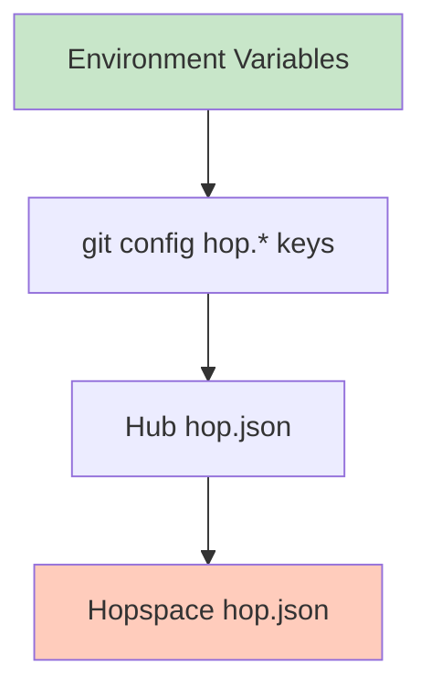

# Configuration Basics

git-hop is configured through a hierarchical system of configuration files and environment variables.

## Configuration Hierarchy

Configuration is loaded from multiple sources, with higher-priority sources overriding lower-priority ones:


```mermaid
graph TD
    A[Environment Variables] --> B[git config hop.* keys]
    B --> D[Hub hop.json]
    D --> E[Hopspace hop.json]
    
    style A fill:#c8e6c9
    style E fill:#ffccbc
```

Priority (highest to lowest):

1. **Environment variables**
2. **git config** `hop.*` keys (repo-local, then `--global`)
3. Hub-level `hop.json`
4. Hopspace-level `hop.json`

Custom package and environment managers are lists and live in
`$XDG_CONFIG_HOME/git-hop/managers.json`.

## Environment Variables

Set environment variables to control git-hop behavior:

### Paths

```bash
export GIT_HOP_DATA_HOME="$HOME/.local/share/git-hop"
export GIT_HOP_CONFIG_HOME="$HOME/.config/git-hop"
export GIT_HOP_CACHE_DIR="$HOME/.cache/git-hop"
```

For logging configuration, see [Logging](./05b-logging).

## Global Configuration

Preferences are `hop.*` keys in git config:

```bash
git config --global hop.worktreeLocation '{hubPath}/hops/{branch}'
git config --global hop.add.fetch true
```

An unset key uses its built-in default. See
[Configuration](configuration.md#settings-reference) for every key and its
default. Older releases read `global.json`; it is migrated into git config
once and then ignored.

## Hub Configuration

Each hub has a `hop.json` file in the hub directory:

```json
{
  "port_base": 10000,
  "port_limit": 5000,
  "services": {
    "enabled": true
  }
}
```

### Creating Hub Config

```bash
# Edit hub config manually
cd org/repo
vim hop.json
```

## Hopspace Configuration

Each hopspace can have its own `hop.json` for branch-specific settings:

```json
{
  "ports": {
    "web": 8080,
    "db": 5432,
    "cache": 6379
  },
  "volumes": {
    "db": "postgres_data"
  },
  "services": {
    "web": {
      "image": "nginx:alpine",
      "port": 8080
    }
  }
}
```

## Configuration Options

### Starting the environment on add and clone

`git hop add` and clone do not start the new worktree's environment unless
asked to. The standing choice is git config, not `hop.json`:

```bash
git config --global hop.autoEnvStart true   # every repository
git config hop.autoEnvStart true            # this repository only
```

| Setting | Behavior |
|---------|----------|
| `false` (default) | Never start automatically; run `git hop env start` |
| `true` | Start once the worktree exists, if it has an environment |

`GIT_HOP_AUTO_ENV_START=true|false` overrides it for one process, and
`--env-start` / `--no-env-start` for one run. The start is the same one
`git hop env start` does; a worktree without an environment is skipped, and
a failed start only warns.

### port_base / port_limit

Configure port allocation range:

```json
{
  "port_base": 10000,
  "port_limit": 5000
}
```

This allocates ports from `10000` to `14999`.

## Docker Configuration

Configure Docker service behavior:

```json
{
  "docker": {
    "compose": "docker-compose",
    "project_prefix": "git-hop",
    "network": "git-hop",
    "remove_orphans": true
  }
}
```

### Service Detection

git-hop detects services from:

```bash tab="docker-compose.yml"
# Automatically detected
version: '3.8'
services:
  web:
    image: nginx:alpine
```

```bash tab="git-hop/services.yml"
# Custom service definition
services:
  web:
    image: nginx:alpine
    ports:
      - 8080
```

## Examples

### Minimal Config

For simple projects without services, nothing to set: environments are
never started unless you ask.

### Service-Focused Config

For projects with Docker services, start them on every add in this
repository:

```bash
git config hop.autoEnvStart true
```

### Team Config

Shared configuration for team members:

```json
{
  "port_base": 20000,
  "port_limit": 10000,
  "docker": {
    "project_prefix": "mycompany"
  }
}
```

### CI Config

Optimized for CI/CD (set `GIT_HOP_AUTO_ENV_START=true` in the job to start
services on add and clone):

```json
{
  "docker": {
    "remove_orphans": true,
    "timeout": 300
  }
}
```

## Validating Configuration

Check your configuration is valid:

```bash
git hop doctor
```

This will:
- Parse all config files
- Check for conflicts
- Validate port ranges
- Verify service definitions

## What's Next?

- [Logging](./05b-logging) - Configure logging and output
- [Workflows](./06-workflows) - See configuration in action
- [Integration](./07-integration) - Integrate with other tools
