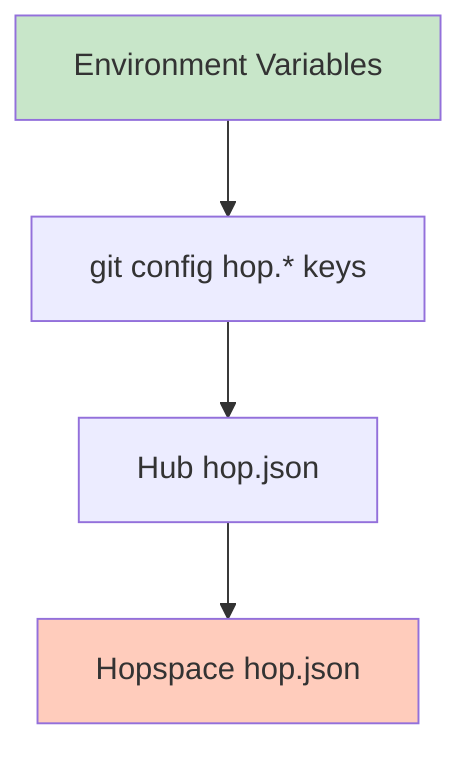

# Configuration Basics

git-hop is configured through a hierarchical system of configuration files and environment variables.

## Configuration Hierarchy

Configuration is loaded from multiple sources, with higher-priority sources overriding lower-priority ones:


```mermaid
graph TD
    A[Environment Variables] --> B[git config hop.* keys]
    B --> D[Hub hop.json]
    D --> E[Hopspace hop.json]
    
    style A fill:#c8e6c9
    style E fill:#ffccbc
```

Priority (highest to lowest):

1. **Environment variables**
2. **git config** `hop.*` keys (repo-local, then `--global`)
3. Hub-level `hop.json`
4. Hopspace-level `hop.json`

Custom package and environment managers are lists and live in
`$XDG_CONFIG_HOME/git-hop/managers.json`.

## Environment Variables

Set environment variables to control git-hop behavior:

### Paths

```bash
export GIT_HOP_DATA_HOME="$HOME/.local/share/git-hop"
export GIT_HOP_CONFIG_HOME="$HOME/.config/git-hop"
export GIT_HOP_CACHE_DIR="$HOME/.cache/git-hop"
```

For logging configuration, see [Logging](./05b-logging).

## Global Configuration

Preferences are `hop.*` keys in git config:

```bash
git config --global hop.worktreeLocation '{hubPath}/hops/{branch}'
git config --global hop.add.fetch true
```

An unset key uses its built-in default. See
[Configuration](configuration.md#settings-reference) for every key and its
default. Older releases read `global.json`; it is migrated into git config
once and then ignored.

## Hub Configuration

Each hub has a `hop.json`. git-hop writes and maintains `repo` and
`branches`; the `settings` object is yours:

```json
{
  "settings": {
    "compareBranch": "develop",
    "environmentManager": "docker-compose",
    "environmentConfig": {
      "hooks": {
        "preStart": ["scripts/load-secrets.sh"],
        "postStop": ["scripts/cleanup.sh"]
      }
    }
  }
}
```

| Key | Effect |
|-----|--------|
| `settings.compareBranch` | Branch `status` and `list` compare worktrees against when a worktree records no base |
| `settings.environmentManager` | Environment manager `env start`/`stop` use instead of detecting one; `none` disables it |
| `settings.environmentConfig.hooks` | Commands run around `env start`/`stop`: `preStart`, `postStart`, `preStop`, `postStop` |

See [Configuration](configuration.md#hub-configuration) for the full file.

## Hopspace Configuration

The hopspace keeps its own files: in the hub for a default clone, under
`$GIT_HOP_DATA_HOME/<org>/<repo>/` for a `--global` one. Its `hop.json` can
override package manager install commands per repository or per branch (see
[Package Manager Overrides](package-manager-overrides.md)); `ports.json`
holds the port range (see [Port range](#port-range)). git-hop maintains the
rest.

## Configuration Options

### Starting the environment on add and clone

`git hop add` and clone do not start the new worktree's environment unless
asked to. The standing choice is git config, not `hop.json`:

```bash
git config --global hop.env.autoStart true   # every repository
git config hop.env.autoStart true            # this repository only
```

| Setting | Behavior |
|---------|----------|
| `false` (default) | Never start automatically; run `git hop env start` |
| `true` | Start once the worktree exists, if it has an environment |

`GIT_HOP_AUTO_ENV_START=true|false` overrides it for one process, and
`--env-start` / `--no-env-start` for one run. The start is the same one
`git hop env start` does; a worktree without an environment is skipped, and
a failed start only warns.

### Port range

Ports come from the range in the hopspace's `ports.json`, which git-hop
creates the first time it allocates ports:

```json
{
  "allocationMode": "incremental",
  "baseRange": { "start": 10000, "end": 20000 }
}
```

Edit `baseRange` to move the range. `allocationMode` is `incremental` (the
default: the next free block after the highest port in use) or `hash`
(opt-in: a block chosen by hashing the repository, hub and branch). Either
way a worktree keeps the ports it has when its environment is generated
again.

## Docker Services

A worktree has a Docker environment when it contains `compose.yaml`,
`compose.yml`, `docker-compose.yml` or `docker-compose.yaml` (first match
wins). git-hop allocates a port per service and writes them, with the volume
paths, to the worktree's `.env` as `HOP_PORT_<SERVICE>` and
`HOP_VOLUME_<NAME>`. There is no Docker section in `hop.json`.

## Examples

### Minimal Config

For simple projects without services, nothing to set: environments are
never started unless you ask.

### Service-Focused Config

For projects with Docker services, start them on every add in this
repository:

```bash
git config hop.env.autoStart true
```

### CI Config

Start services on add and clone in a CI job without touching git config:

```bash
export GIT_HOP_AUTO_ENV_START=true
```

## Validating Configuration

Check your configuration is valid:

```bash
git hop doctor
```

It checks paths, the hub and its hopspace, dependencies, worktrees, state
and git config, and reports what it finds.

## What's Next?

- [Logging](./05b-logging) - Configure logging and output
- [Workflows](./06-workflows) - See configuration in action
- [Integration](./07-integration) - Integrate with other tools
