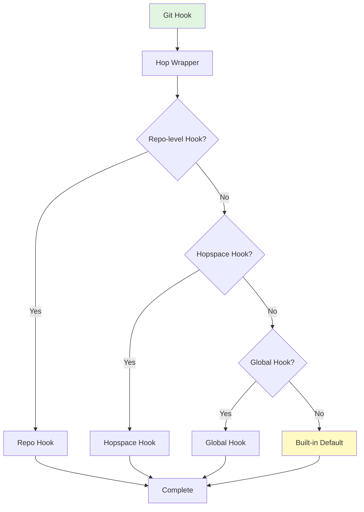

# Integration

git-hop integrates seamlessly with Git, Docker, and your development tools.

## Git Hooks

git-hop installs lightweight Git hook wrappers that call internal hop-hooks.

### Hook Order



### Available Hooks

| Hook | Description |
|------|-------------|
| `pre-worktree-add` | Before creating a worktree |
| `post-worktree-add` | After creating a worktree |
| `pre-env-start` | Before starting environment |
| `post-env-start` | After starting environment |
| `pre-env-stop` | Before stopping environment |
| `post-env-stop` | After stopping environment |

### Custom Hooks

Create custom hooks in your hopspace:

```bash
# In your hopspace
mkdir -p .git-hop/hooks

# Create a custom hook
cat > .git-hop/hooks/post-env-start << 'EOF'
#!/bin/bash
echo "Environment started for $(git branch --show-current)"
# Run custom initialization
npm install
make db-migrate
EOF

chmod +x .git-hop/hooks/post-env-start
```

### Example: Auto-run Tests on Environment Start

```bash
# .git-hop/hooks/post-env-start
#!/bin/bash
# Run tests after starting environment
make test || echo "Tests failed!"
```

### Example: Notify Team on Worktree Creation

```bash
# .git-hop/hooks/post-worktree-add
#!/bin/bash
BRANCH=$(git branch --show-current)
SLACK_WEBHOOK="https://hooks.slack.com/..."

curl -X POST "$SLACK_WEBHOOK" \
  -H 'Content-Type: application/json' \
  -d "{\"text\":\"New worktree created: $BRANCH\"}"
```

## Docker Services

git-hop automatically detects and orchestrates Docker services.

### Service Detection Order

git-hop looks for service definitions in this order:

```bash tab=".git-hop/services.yml"
# Highest priority
services:
  web:
    image: nginx:alpine
    ports:
      - 8080
```

```bash tab="docker-compose.<branch>.yml"
# Branch-specific
version: '3.8'
services:
  web:
    image: nginx:alpine
```

```bash tab="docker-compose.yml"
# Default
version: '3.8'
services:
  web:
    image: nginx:alpine
```

### Service Templates

Create reusable service templates:

```bash tab="Template"
# .git-hop/services.template.yml
version: '3.8'
services:
  web:
    image: ${WEB_IMAGE}
    ports:
      - "${WEB_PORT}:80"
  db:
    image: ${DB_IMAGE}
    ports:
      - "${DB_PORT}:5432"
```

```bash tab="Instantiation"
# hop.json
{
  "services": {
    "template": "services.template.yml",
    "variables": {
      "WEB_IMAGE": "nginx:alpine",
      "WEB_PORT": 8080,
      "DB_IMAGE": "postgres:15",
      "DB_PORT": 5432
    }
  }
}
```

### Custom Service Configuration

Override service settings per branch:

```bash tab="Main Branch"
# docker-compose.main.yml
version: '3.8'
services:
  db:
    image: postgres:14
```

```bash tab="Feature Branch"
# docker-compose.feature-x.yml
version: '3.8'
services:
  db:
    image: postgres:15
```

## CI/CD Integration

Use git-hop in CI/CD pipelines for isolated test environments.

### GitHub Actions Example

```yaml
name: CI with git-hop

on: [push, pull_request]

jobs:
  test:
    runs-on: ubuntu-latest
    steps:
      - uses: actions/checkout@v3
      
      - name: Install git-hop
        run: |
          go install github.com/jadb/git-hop@latest
          echo "$HOME/go/bin" >> $GITHUB_PATH
      
      - name: Create hopspace
        run: |
          git hop origin/main
          cd main
          
      - name: Start environment
        run: |
          cd main
          git hop env start
          
      - name: Run tests
        run: |
          cd main
          make test
          
      - name: Cleanup
        if: always()
        run: |
          cd main
          git hop env stop
```

### GitLab CI Example

```yaml
test:
  image: golang:1.21
  services:
    - docker:dind
  variables:
    GIT_HOP_AUTO_ENV_START: "true"
  script:
    - go install github.com/jadb/git-hop@latest
    - export PATH="$PATH:$HOME/go/bin"
    - git hop origin/main
    - cd main
    - make test
    - git hop env stop
```

## Editor Integration

### VS Code

Create VS Code workspace settings for multi-branch development:

```json
// .vscode/settings.json
{
  "git.openRepositoryInParentFolders": "always",
  "files.exclude": {
    "**/.git-hop": true
  },
  "terminal.integrated.cwd": "${workspaceFolder}"
}
```

### Vim/Neovim

Configure Vim to work with git-hop:

```vim
" .vimrc
" Auto-cd to worktree
autocmd BufEnter * silent! lcd %:p:h:gs/^.*my-project\///:h
```

### JetBrains IDEs

Configure multiple working directories:

1. **File → Settings → Project → Directories**
2. Add each worktree as a content root
3. Configure separate module for each branch

## Shell Integration

### Bash/Zsh Functions

Add helpful aliases to your shell:

```bash
# ~/.bashrc or ~/.zshrc

# Quick hop command
alias gh='git hop'

# Hop and cd
function ghcd() {
  git hop "$1"
  cd "$1" || return 1
}

# List hopspaces with sizes
alias ghl='git hop && du -sh ~/.local/share/git-hop/*/*/* 2>/dev/null'
```

### Auto-completion

git-hop includes shell auto-completion:

```bash
# Load completions
source <(git-hop completion bash)
# or
source <(git-hop completion zsh)
```

## What's Next?

- [Advanced Usage](/docs/08-advanced-usage) - Explore advanced features
- [Reference](/docs/09-reference) - Complete command and config reference
- [FAQ](/docs/10-faq) - Common questions and answers
