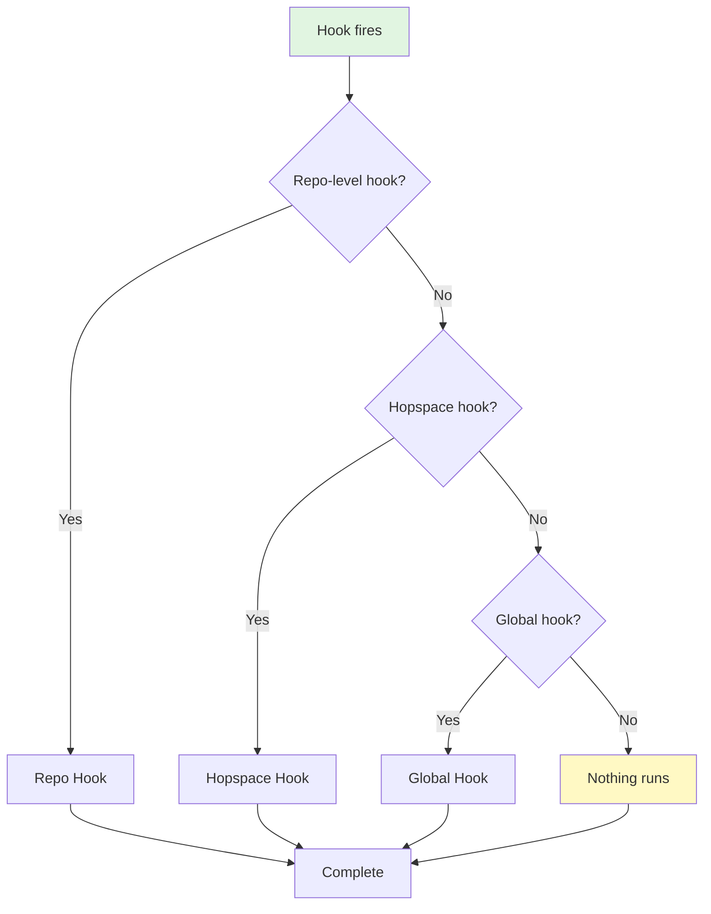

# Integration

git-hop integrates seamlessly with Git, Docker, and your development tools.

## Lifecycle Hooks

git-hop runs its own lifecycle hooks: executable files named after the
hook. They are not git's hooks and never live in `.git/hooks/`.

### Hook Order

The first file found wins; a missing hook is a silent no-op.


```mermaid
graph TD
    A[Hook fires] --> C{Repo-level hook?}
    C -->|Yes| D[Repo Hook]
    C -->|No| E{Hopspace hook?}
    E -->|Yes| F[Hopspace Hook]
    E -->|No| G{Global hook?}
    G -->|Yes| H[Global Hook]
    G -->|No| I[Nothing runs]

    D --> J[Complete]
    F --> J
    H --> J
    I --> J

    style A fill:#e1f5e1
    style I fill:#fff9c4
```

- Repo: `<worktree>/.git-hop/hooks/<name>`, walking up parent directories,
  so a hub-level `.git-hop/hooks/` applies to every worktree
- Hopspace: `$GIT_HOP_DATA_HOME/<org>/<repo>/hooks/<name>` (per
  `hop.dataLayout`)
- Global: `$XDG_CONFIG_HOME/git-hop/hooks/<name>`

### Available Hooks

| Hook | Runs |
|------|------|
| `pre-worktree-add` / `post-worktree-add` | Around `git hop add` (`post-` also for the first worktree of clone and init) |
| `pre-worktree-remove` / `post-worktree-remove` | Around `git hop remove` |
| `pre-worktree-move` / `post-worktree-move` | Around `git hop move` |
| `pre-worktree-switch` / `post-worktree-switch` | Around `git hop <branch>`; `post-` also on a plain `cd` into a worktree |
| `pre-clone` / `post-clone` | Around `git hop clone` |
| `pre-repair` / `post-repair` | Around `git hop repair` |

A non-zero exit from a `pre-` hook aborts the command; a failing `post-`
hook only warns. `pre-env-start`, `post-env-start`, `pre-env-stop` and
`post-env-stop` are accepted names but never run. See
[Hooks System](./hooks) for levels, variables and details.

### Custom Hooks

Commit hooks to the repository so every clone gets them:

```bash
mkdir -p .git-hop/hooks

cat > .git-hop/hooks/post-worktree-add << 'EOF'
#!/bin/bash
echo "Worktree ready for $GIT_HOP_BRANCH"
cd "$GIT_HOP_WORKTREE_PATH" && npm install
EOF

chmod +x .git-hop/hooks/post-worktree-add
```

### Example: Notify Team on Worktree Creation

```bash
# .git-hop/hooks/post-worktree-add
#!/bin/bash
SLACK_WEBHOOK="https://hooks.slack.com/..."

curl -X POST "$SLACK_WEBHOOK" \
  -H 'Content-Type: application/json' \
  -d "{\"text\":\"New worktree created: $GIT_HOP_BRANCH\"}"
```

### Running Commands Around `env start` / `env stop`

`git hop env start` and `env stop` run commands declared in the hub's
`hop.json`, not hook files:

```json
{
  "settings": {
    "environmentConfig": {
      "hooks": {
        "preStart": ["scripts/load-secrets.sh"],
        "postStart": ["make db-migrate", "make test"],
        "preStop": [],
        "postStop": []
      }
    }
  }
}
```

Each command runs in the worktree. See
[Two different hook systems](./hooks#two-different-hook-systems).

## Docker Services

git-hop automatically detects and orchestrates Docker services.

### Service Detection

A worktree has a Docker environment when it holds one of these compose
files; the first one found is used:

1. `compose.yaml`
2. `compose.yml`
3. `docker-compose.yml`
4. `docker-compose.yaml`

There are no branch-specific compose files, service templates or service
settings in `hop.json`. git-hop allocates a port per service from the
hopspace's `ports.json` range and writes the ports and volume paths to the
worktree's `.env` as `HOP_PORT_<SERVICE>` and `HOP_VOLUME_<NAME>`, which the
compose file can reference:

```yaml
# compose.yaml
services:
  web:
    image: nginx:alpine
    ports:
      - "${HOP_PORT_WEB}:80"
```

A compose file with hardcoded host ports gets a generated override file
that remaps them, so branches do not collide.

## CI/CD Integration

Use git-hop in CI/CD pipelines for isolated test environments.

### GitHub Actions Example

```yaml
name: CI with git-hop

on: [push, pull_request]

jobs:
  test:
    runs-on: ubuntu-latest
    steps:
      - uses: actions/checkout@v3
      
      - name: Install git-hop
        run: |
          git clone --depth 1 https://github.com/hop-top/git.git /tmp/git-hop
          make -C /tmp/git-hop build
          mkdir -p "$HOME/.local/bin" && mv /tmp/git-hop/git-hop "$HOME/.local/bin/"
          echo "$HOME/.local/bin" >> $GITHUB_PATH
      
      - name: Create hopspace
        run: |
          git hop origin/main
          cd main
          
      - name: Start environment
        run: |
          cd main
          git hop env start
          
      - name: Run tests
        run: |
          cd main
          make test
          
      - name: Cleanup
        if: always()
        run: |
          cd main
          git hop env stop
```

### GitLab CI Example

```yaml
test:
  image: golang:1.26
  services:
    - docker:dind
  variables:
    GIT_HOP_AUTO_ENV_START: "true"
  script:
    - git clone --depth 1 https://github.com/hop-top/git.git /tmp/git-hop
    - make -C /tmp/git-hop build
    - export PATH="/tmp/git-hop:$PATH"
    - git hop origin/main
    - cd main
    - make test
    - git hop env stop
```

## Editor Integration

### VS Code

Create VS Code workspace settings for multi-branch development:

```json
// .vscode/settings.json
{
  "git.openRepositoryInParentFolders": "always",
  "files.exclude": {
    "**/.git-hop": true
  },
  "terminal.integrated.cwd": "${workspaceFolder}"
}
```

### Vim/Neovim

Configure Vim to work with git-hop:

```vim
" .vimrc
" Auto-cd to worktree
autocmd BufEnter * silent! lcd %:p:h:gs/^.*my-project\///:h
```

### JetBrains IDEs

Configure multiple working directories:

1. **File → Settings → Project → Directories**
2. Add each worktree as a content root
3. Configure separate module for each branch

## Shell Integration

### Bash/Zsh Functions

Add helpful aliases to your shell:

```bash
# ~/.bashrc or ~/.zshrc

# Quick hop command
alias gh='git hop'

# Hop and cd
function ghcd() {
  git hop "$1"
  cd "$1" || return 1
}

# List hopspaces with sizes
alias ghl='git hop && du -sh ~/.local/share/git-hop/*/*/* 2>/dev/null'
```

### Auto-completion

git-hop includes shell auto-completion:

```bash
# Load completions
source <(git-hop completion bash)
# or
source <(git-hop completion zsh)
```

## What's Next?

- [Advanced Usage](./08-advanced-usage) - Explore advanced features
- [Reference](./09-reference) - Complete command and config reference
- [FAQ](./10-faq) - Common questions and answers
